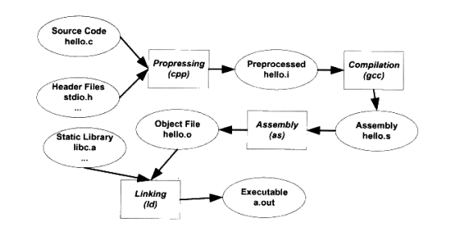

# 一、编译和链接
## 1、编译过程
    #include <stdio.h>

    int main(){
        printf("Hello World \n");
        return 0;
    }

    在linux下，我们使用GCC 编译该程序。

    $ gcc hello.c
    $ ./a.out
    Hello World

    编译该程序的过程可以分解为4个步骤，分别是：预处理(Preprocessing)、编译(Compilation)、汇编(Assembly)和链接(Linking)。
    
### 1.1 预处理
    预处理的过程相当于如下命令：
    `$ gcc -E hello.c -o hello.i `
    预处理过程主要处理预编译指令，如"#include"、"#define"等。
### 1.2 编译
    编译是把预处理完的文件进行一系列词法分析、语法分析、语义分析及优化后生成相应的汇编代码文件。相当于如下命令：
    `$ gcc -S hello.i -o hello.s`
### 1.3 汇编
    汇编是将汇编代码转变为机器指令。
    $as hello.s -o hello.o
    或者：
    $gcc -c hello.s -o hello.o
    或者使用gcc命令从源代码文件开始，经过预处理、编译和汇编直接输出目标文件：
    $gcc -c hello.c -o hello.o
### 1.4 链接
    为什么汇编器不直接输出可执行文件而是输出一个目标文件？为什么要链接？
    来看看如何调用ld 才可以产生一个能够正常运行的HelloWorld程序：
    $ld -static crt1.o crti.o crtbeginT.o hello.o -start-group -lgcc -lgcc_eh -lc -end-group crtend.o crtn.o
    可以看出，我们需要一大堆文件链接起来才可以得到 a.out。
## 2、编译器做了什么
    词法分析
    语法分析
    语义分析
    中间语言生成
    目标代码生成与优化
## 3、链接器
    链接器将各个模块编译出来的目标文件(如：.o 和 .obj)和库一起链接，形成最终可执行文件。链接过程主要包括：地址和空间分配、符号决议和重定位。
    eg:程序有两个.c 文件：main.c 和 fun.c, main.c 中使用了 fun.c 中的 fun() 函数。那么在main.c 中使用 fun()的地方，都需要明确知道fun() 的地址。但是由于每个模块(每个.c)都是单独编译，在编译器编译 main.c 时，并不知道 fun() 的地址，所以暂时将该地址搁置。等到链接阶段，由链接器填入 fun() 的地址。

# 二、目标文件
    既然，链接器将目标文件和库链接到一起，那么目标文件中有什么？
## 2.1 目标文件格式
    可执行文件格式主要为 Windows下的PE 和 Linux 下的ELF。目标文件(.o) 、动态链接库(.so)和静态链接库(.a)都采用可执行文件格式存储。
## 2.2 目标文件的内容
    目标文件包含了编译后的机器指令代码、数据;还包括链接时需要的信息，如符号表、调试信息、字符串等。一般，目标文件将这些信息按不同的属性，以节(Section)或段(segment)的形式存储。主要包括：代码段、数据段和只读数据段、BSS段及其他段
    程序源代码编译后的机器指令放在代码段(.code 或 .text);已初始化的全局变量和局部静态变量数据放在数据段(.data)，未初始化的全局变量和局部静态变量放在.bss 段。
    有些编译器会将全局的未初始化变量存放在目标文件的 .bss 段，有些则不存放，只是预留一个未定义的全局变量符号，等到最终链接成可执行文件的时候再在 .bss 段分配空间。但是静态全局变量会存放在目标文件的 .bss 段。(原因是：全局的未初始化变量为弱符号，该符号的最终所占空间大小在编译该模块时是未知的，有可能存在其他同名的弱符号或强符号；在链接时是可以确定弱符号大小了。静态全局变量只对当前文件可见，大小已知)
## 2.3 ELF文件结构描述
    文件头：文件头定义了数据存储方式、版本、运行平台、重定位类型、程序头入口等信息
    段表：保存各个段的信息，如段名、段的长度、偏移、读写权限等。
    重定位表：链接器在处理目标文件时，需要对目标文件中某些信息进行重定位，这些信息都记录在重定位表里。对于每个需要重定位的代码段或数据段，都会有一个相应的重定位表。
## 2.4 符号
    每一个目标文件都会有一个相应的符号表，记录了目标文件中所用到的所有符号。
### 2.4.1 函数签名和符号修饰
    函数签名：包含函数的返回值、函数名和参数，如 int func(int x)
    符号名冲突问题：多个模块中有同名函数或者变量，在目标文件中的符号名就会冲突。
    
    C++ 的特性如：类、继承、虚机制、重载、名称空间等，使得符号管理更为复杂。为了支持这些特性，人们发明了符号修饰或符号改编机制。
    
    编译器在将C++源代码编译成目标文件时，会将函数和变量的名字进行修饰，形成符号名。也就是说，C++的源代码编译后的目标文件中所使用的符号名是相应的函数和变量修饰后的名称。
    以函数重载为例，C++ 允许多个不同参数类型的函数拥有一样的名字。
    如：
    函数签名                修饰后的名称
    int func(int)           _Z4funci
    float func(float)       _Z4funcf
    int C::func(int)        _ZN1C4funcEi
    GCC基本C++名称修饰方法为：所有的符号已 "_Z" 开头，对于嵌套的名字(在名称空间或在类里)，后面紧跟 "N"，然后是各个名称空间和类的名字，每个名字前是名字字符串的长度，再以"E"结尾。
### 2.4.2 extern "C
    C++编译器将 extern "C" 包含的代码当做C 语言代码处理。所以，C++的名称修饰机制将不会起作用。
    如：在string.h 中声明的 memset 函数，其原型是： void* memset(void* , int , size_t);
    如果不加任何处理，当我们在C++中包含string.h 时，编译器将 memset 的符号修饰为 _6memsetPvii,这样链接器就无法与C语言库中的 memset 符号进行链接。所以对于C++。必须使用 extern "C" 来声明这个函数。
    #ifdef _cplusplus
    extern "C"{
    #endif
        void* memset(void* , int , size_t);
    #ifdef _cplusplus
    }
    #endif
### 2.4.3 强符号和弱符号
    对于C/C++来说，函数和初始化了的全局变量为强符号，未初始化的全局变量为弱符号。也可以通过GCC的 "__attribute__((weak))" 来定义任何一个强符号为弱符号。
    链接器处理强弱符号规则：
    1：不允许强符号被多次定义，如果有多个强符号，则报重复定义错误。
    2：如果一个符号在某个目标文件中为强符号，在其他文件中为弱符号，那么选择强符号。
    3：如果一个符号在所有目标文件中都是弱符号，那么选择其中占用空间最大的一个。
### 2.4.4 弱引用和强引用
    强引用：对外部目标文件的符号引用在链接时没有找到定义，链接器会报符号未定义错误。
    弱引用：链接器未找到定义时，不会报错。一般对于未定义的弱引用，链接器默认其为0，或者一个特殊的值。

    在GCC中，可以使用 "__attribute__((weakref))" 声明对一个外部函数的引用为弱引用。如：
    __attribute__ ((weakref)) void foo();

    int main(){
        foo();
    }
    可以将它编译成一个可执行文件，GCC 不会报链接错误，但是会发生运行错误。因为当 main 函数调用 foo 函数时，foo函数的地址为0，发生了非法地址访问的错误。改进的方式为：
    __attribute__ ((weakref)) void foo();

    int main(){
        if(foo) foo();
    }
